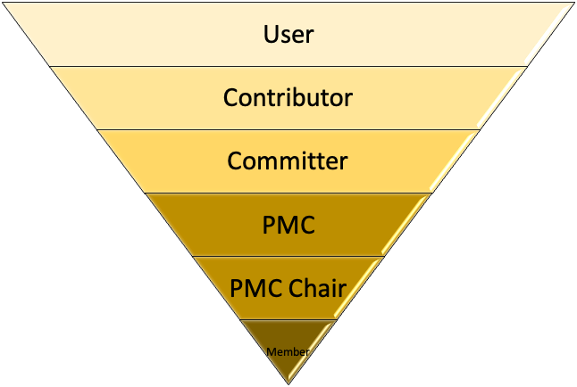

# 开源贡献简介
- 开源意味着开放、协作、公开、透明，大家都可以检查、修改并分享内容。

- 开源软件按照去中心化、协作的方式发展，依赖社区共同治理；所以开源软件更廉价、更灵活，生命力也更旺盛、持久。

- 开源社区的理念是：社区高于代码，社区需要多元化。无论你写代码，撰写用户手册、技术博客，设计网站，还是策划社区活动，这些都是在为社区做贡献。

- 开源社区鼓励大家公开协作，无论你擅长什么，只要你愿意，你都可以在开源的舞台上发光发热。你付出的越多，收获的就越多。

# 为什么要贡献开源
从公司的角度来说，大部分企业有充足的理由去贡献开源项目，并因此受益，比如：
- 吸引人才
- 降低维护成本
- 项目影响力

所以很多大型公司如 Google、Intel、IBM、阿里、华为、百度、小米等都设立了专门的开源项目部门专为开源社区做贡献。

从个人角度来说，开源就像自助餐中的像啤酒一样，意味着免费 - 没有人会为您的拉取请求支付任何费用。但这并不意味着您不能因此受益。通过这种公开透明的协作方式为开源做贡献，你可以
- 提高个人知名度和影响力
- 提升履历价值
- 成为精英管理中的骨干 

# 如何贡献
Apache 软件基金会、CNCF、Linux Foundation 等有成千上万的开源项目，怎么找到合适的项目贡献呢？我们以 Apache 项目为例来介绍如何上手。
1. 了解 [Apache 软件基金会的社区理念](https://apache.org/foundation/how-it-works.html)，深入了解社区高于代码
2. [找到合适的项目](https://community.apache.org/gettingStarted/101.html):你正在使用的，或者你感兴趣的
3. [发现问题，并尝试解决](https://community.apache.org/gettingStarted/101.html)
4. 加入社区：订阅邮件列表、加入项目 Slack、微信交流群，关注项目 Twitter、LinkedIn 等动态。大胆在邮件列表中介绍自己，并积极参与问题讨论。

## 贡献内容
无论你从事什么职业，为哪个开源项目做贡献，你可以在以下方面充分发挥自己的特长：
- 写代码
- 测试
- 写文档
- 审校 PR
- 解决用户问题
- 设计网站
- 举办社区活动
- ......

## 贡献路径
1. 成为开源项目的用户：使用该项目
2. 成为贡献者：发现问题、解决问题
3. 成为 committer
4. 成为 PMC（项目管理委员会）
5. 尝试担任 PMC Chair
6. 成为 ASF 成员

# 示例

- [ASF 贡献者指南](https://community.apache.org/newcomers/) 
- [Apache Pulsar 贡献者指南](https://pulsar.apache.org/en/contributing/) 
- [KubeSphere 贡献指南](https://kubesphere.io/contribution/)

# Checklist
1. 项目主 repo 的根目录中是否有贡献者指南
2. 项目 readme 中是否提及贡献者指南
3. 贡献者指南中包含哪些内容
4. 贡献者指南是否简介明了、清晰易懂
